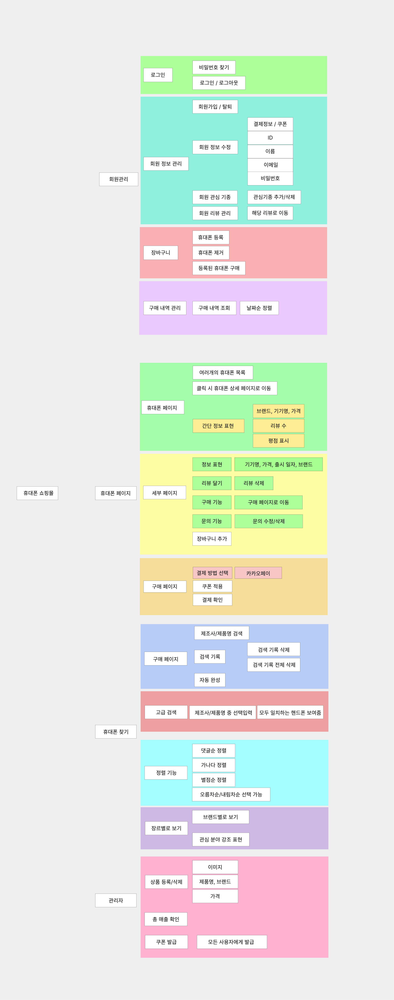

<h1 align="center">📱 SimPhone</h1>
<h3 align="center">스마트폰 비교 & 구매 플랫폼</h3>

  
  
  

  

---

## 📌 목차
- [🌐 홈페이지](#-홈페이지)
- [🧩 기능구성도](#-기능구성도)
- [📄 API 명세서](#-api-명세서)
- [💻 코드](#-코드)
- [📱 App 설치](#-app-설치)
- [🎬 시연동영상](#-시연동영상)
- [📊 비교표](#-작년-우수팀과-비교표)

---

## 🌐 홈페이지

> 💡 실제 서비스 운영 중

🔗 **https://simphone.kro.kr/**

---

## 🧩 기능구성도

🔽 클릭해서 보기

 

  

---

## 📄 API 명세서

🔽 클릭해서 보기

 

  

---

## 💻 코드

### 🔹 Backend

  

🔗 https://github.com/JunghunnKim/capstone-phoneshop-backend  

---

### 🔹 Frontend

  

🔗 https://github.com/gityskim/capstone-phoneshop-frontend  

---

### 🔹 Mobile

#### 📱 iOS

  

🔗 https://github.com/realNahyeonPark/capstone-ios-phoneshop  

---

#### 🤖 Android

  

🔗 https://github.com/shinminseok0/Android  

---

## 📱 App 설치

| 플랫폼 | 상태 |
|------|------|
| 🍎 App Store | 🔄 준비중 |
| 🧪 TestFlight | 🔄 준비중 |
| 🤖 Google Play | 🔄 준비중 |

---

## 🎬 시연동영상

  
  
  
  

---

## 📊 작년 우수팀과 비교표

| 항목 | 🌟 SimPhone | 🏆 최우수 | 🥈 우수1 | 🥉 우수2 | 🎖 우수3 |
|------|:---:|:---:|:---:|:---:|:---:|
| Code | ✅ | ✅ | ✅ | ✅ | ✅ |
| Doc | ✅ | ✅ | ✅ | ❌ | ✅ |
| 영상 | ✅ | ✅ | ❌ | ❌ | ❌ |
| 화면 | **iOS / Android / Web** | Web | Web | Web | Web |
| AppStore/GooglePlay | ✅ | ❌ | ❌ | ❌ | ❌ |

## 🔗 참고 (작년 우수팀 GitHub)

- 🏆 최우수: https://github.com/HwangCheese/VideoSummary  
- 🥈 우수1: https://github.com/GolddBunny/Domain_QA_Gen  
- 🥉 우수2: https://github.com/kola0709/2025Capstone/tree/master  
- 🎖 우수3: https://github.com/hsu-capstone-prism/DamSeol  

---

